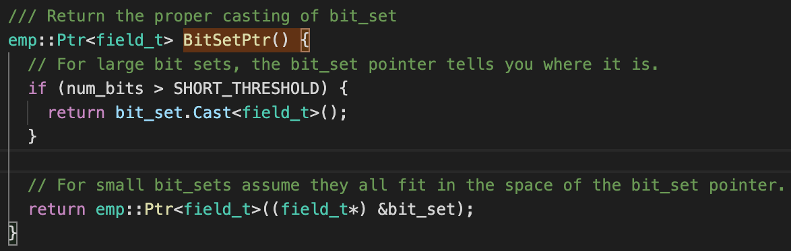

* INTRODUCTION
  1. Briefly describe code optimization and give some reasons as to why it is so important.
  2. Give a quick rundown on BitVector and DataMap and why they matter.
    1. Describe BitVector and compare it to a vector of bools and a vector of bytes.
    2. Describe DataMap and compare it to regular maps.
  3. Give an overview of my two projects this workshop.
    1. Define "Small BitVector Optimization" and include a small diagram of how the memory is used in a small versus a large BitVector.
    2. Define "DataMap Reference Capability" and include a small diagram of how the memory is used in a new DataMap entry, both in the normal way and as a reference.
* BITVECTOR PROJECT
  1. Show the code for the method BitSetPtr and explain how and why it works.
    * 
  2. Describe some of the issues which arose during this project.
    1. The deferenced Ptr issue.
    2. The masking issue(s).
  3. Give speedups for every single method. (WIP, I intend to use the HPCC for this)
  4. Give more detailed and accurate speedups for the important methods (gets and sets). (WIP, I intend to use the HPCC for this)
* DATAMAP PROJECT
  1. Make a detailed diagram of how DataMap handles each entry (far more than just the bit representations).
  2. Explain how a DataMap which handles references is important. 
  3. Point out the places which need a specific way to handle references.
  4. Describe some of the issues which arose during this project.
    1. The copy issue.
    2. The constructor/destructor issue.
  5. Give speedups for all gets and sets. (WIP, I intend to use the HPCC for this)
* CONCLUSION
  1. Describe overarching benefits for Empirical from the BitVector project.
  2. Describe overarching benefits for Empirical from the DataMap project.
  3. Describe how they can work together.
  4. Give a total speedup for MABE due to my two projects. (WIP, I need to talk to Dr. Ofria about this)
  5. The obligatory corny (but true) "I had a great time and this was an amazing experience and I was given really fun projects" concluding statement.
