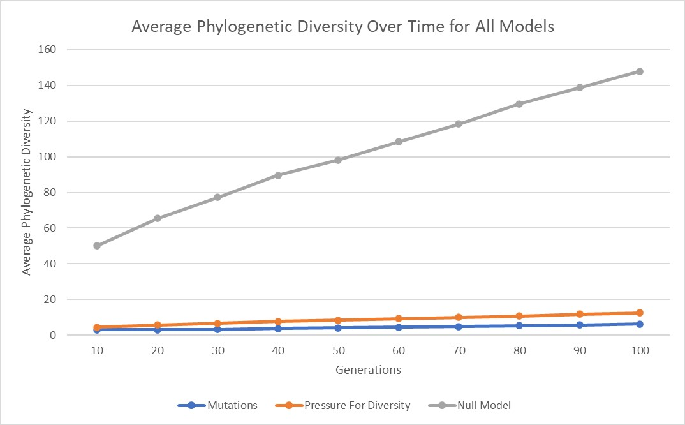
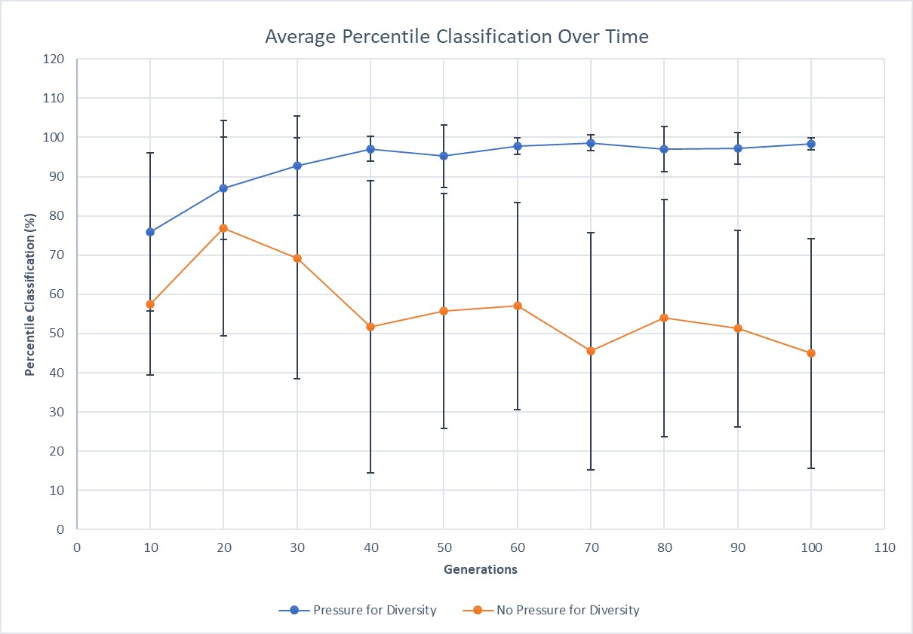

# Systematics Normalization
I collaborated on this project with my mentors, Emily Dolson and Kate Skocelas.


## Goal: 
The purpose of this project is to develop a way to compare phylogenetic trees of different sizes and characteristics in a standardized way. 

#### Motivation: 
Within Empirical as it is now, there is not a good way to compare phylogenetic trees with one another. Different generational sizes and characteristics make it hard to obtain statistically significant data in terms of comparison. This project aims to solve this. 

#### Steps: 
 1. Creation of a **null model** of a phylogenetic tree 

 2. Creation of a tree that **mutates** and diverges in a non-random way
 3. Creation of a tree which accounts for **pressure for diversity** and **mutation**
 4. Comparing trees from steps 3 and 4 with each other and our null model 

 -------------------------------------------

## Background

### Phylogenetic Trees

A phylogenetic tree is a commonly used diagram in biology. Phylogenetic trees are used to show evolutionary relationships between organisms. The tree begins with a single population and branches when a portion of the population mutates. Because of this, phylogenetic trees are a great way to show how a population has evolved from a single individual or group.

_This is a diagram of a basic phylogenetic tree. In this diagram, the tree mutated 4 times (as shown by each divergence of the tree at each node). The final 5 populations each have unique genotypes._ 


--------------------------------------------------------------------------

### **Systematics** 

Systematics.h is file manager in Empirical. It is used to track genotypes, species, clades, or lineages of organisms. Systematics allows a user to create phylogenetic trees with various levels of abstraction -- using genotypes, phenotypes, etc, to keep track of lineage. 

This project focused on two topics -- creating models to establish the possible range of phylogenetic diversity, then testing those models, and lastly, incorporating these percentiles into systematics so that a user could find out how their own trees compare. 

Within the systematics manager, I added two functions to use when calculating phylogenetic diversity. 

The first function, ```FindPhyloData()```, can be used if a user wants to compare results with the null model. It will calculate the phylogenetic diversity wherever the function is called and return the percentile corresponding to that value based on the data from the null model, which is stored in tree_percentiles.csv. 

**_in the final draft the included code will be simplified and commented more_**

```c++
  int FindPhyloData(){
    int percentile; 

    emp::File tree_percentiles("tree_percentiles.csv"); //loading file

    emp::vector< emp::vector<double> > percentile_data = tree_percentiles.ToData<double>(','); //turns data into an array

     int PhyloDiversity = GetPhylogeneticDiversity(); 

    for (int i = 0; i < percentile_data.size() - 1; i++){ 

        if( (PhyloDiversity >= percentile_data[i][1]) && (PhyloDiversity < percentile_data[i + 1][1])){ 
           std::cout << "Phylogenetic Diversity (recorded in systematics): " << PhyloDiversity << std::endl; 
           std::cout << "phylo diversity is in between: " << percentile_data[i][1] << " and " << percentile_data[i + 1][1] << std::endl; 
           std::cout << PhyloDiversity << " is in percentile: " << percentile_data[i][0] << std::endl;       

           percentile = percentile_data[i][0];

           std::cout << percentile << std::endl; 
           }
      }
      return percentile; 
    }
```

The following function is used for trees that contain pressure for diversity or mutations. It can also be used for multiple generations (10 through 100 gens). When called, it takes an argument of the number of generations. This corresponds to a line in OrgGenotypePercentiles.csv, each containing percentiles for different numbers of generations. This function only allows users to use multiples of 10 for the generation numbers though. For example, 10, 20, 30, ... 100 generations. 

_Right now, this function is used for testing our findings and prints the data to PercentileDataFullNoPressure.csv. This will probably be changed in the final product._

```c++
    void FindPhyloMultipleGens(int GenValueRaw){ 
      int GenValue = ((GenValueRaw / 10) - 1); 
      int percentile; 
      bool percentFound = false; 

        emp::File generation_percentiles("OrgGenotypePercentiles.csv");
        emp::vector< emp::vector<double> >percentile_data2 = generation_percentiles.ToData<double>(',');

      int PhyloDiversity = GetPhylogeneticDiversity(); 
      int lastval = size(percentile_data2[GenValue]) - 1; 
      std::cout << "Last element of array is: " << percentile_data2[GenValue][lastval] << std::endl;

      std::fstream fs; 
      fs.open("PercentileDataFullNoPressure.csv", std::fstream::in | std::fstream::out | std::fstream::app);

        //for(int i = 0; i < percentile_data2.size() - 1; i++){ 
          for(int j = 0; j <= percentile_data2[GenValue].size() - 2; j++){
          
          if((percentile_data2[GenValue][j] <= PhyloDiversity) && (percentile_data2[GenValue][j + 1] > PhyloDiversity)){
            std::cout << "phylo diversity is in between: " << percentile_data2[GenValue][j] << "and " << percentile_data2[GenValue][j+1] << std::endl;
            std::cout << "I is equal to: " << GenValue << std::endl; 
            std::cout << "J is equal to: " << j << std::endl;

            std::cout << "The Phylogentic diversity value " << PhyloDiversity << " is in the " << j << " percentile, in the " << ((GenValue + 1)* 10) << " generation" << std::endl;  

            fs << ((GenValue + 1)* 10) << "," << j << std::endl; 

            percentFound = true; 
          }
          
          if(PhyloDiversity >= percentile_data2[GenValue][lastval]){ 
              fs << ((GenValue + 1) * 10) << "," << 100 << std::endl; 
              fs.close(); 
            }

        if(percentFound == true){ 
            break; 
          }
          }
          if(percentFound == false){ 
            std::cout << "PHYLO DIVERSITY IS IN 100TH PERCENTILE" << std::endl; 
           }
        }
```

### **Phylogenetic Diversity**

We decided that I would use phylogenetic diversity as our metric for comparison. I could have also used evolutionary distinctiveness, however, phylogenetic diversity is a highly applicable trait among trees, and it is easy to calculate, making it a desirable metric for comparison. 

Within systematics and my models, phylogenetic diversity is defined as the number of internal nodes in the tree plus the number of extant taxa, minus one. This metric assumes that all branches from parent to child have a length of one. 

As tree depth increases, the overall phylogenetic diversity also increases. This is very clearly illustrated in all 3 of my models and is shown in the graph below. 



As seen in the graph above, the average phylogenetic diversity increases for all three models as the depth of the tree (number of generations) increases. 

### **The Null Model**

A null model is a randomly generated model of an object or structure that is not constrained by its typical characteristics, and is instead based on the randomization of data and structure. A null model attempts to achieve the most unbiased model possible. 

Coming up with a null model of a tree was not the most intuitive, but we decided that having the most randomly generated model was the best option. 

We randomized how organisms were selected and how the tree branched as a result. 

The way that organisms were chosen for reproduction is shown here: 

```c++
int chooseOrg(vector<Organism> &currentGen, emp::Random &randNum){

    parentNum = randNum.GetInt(size(currentGen));  //chooses random spot 
    return parentNum;
}
```

Here the Empirical random number generator was utilized to ensure that results were actually random. Here, a random number was generated based on the size of the parent generation. That spot in the array was then set as the parent of the next generation. 

In the null model, each time a new organism was created it represented its own clade or taxon to ensure maximum diversity. 

### **Mutation and Pressure for Diversity** 

**Mutation**

The trees we used for comparison were trees with mutations and pressure for diversity. 

The mutation rate used for all of the trees was 0.05, which is a typical value for tree modeling in Empirical. In these models, each organism had a genotype as an attribute. 

Mutation was determined randomly. The population generated in the first round of the tree all had a genotype of integer 0. A random double between 0 and 1 was generated with each creation of an organism following this generation. If the value generated was less than 0.05, the genotype would mutate. If a mutation was required, a new random number would be generated between -3 and 3. That genotype would then be subtracted from the original genotype. 

For example, if the organism had a genotype of 2, and was chosen to mutate, and the mutated genotype generated was -3, the new genotype for that organism would be 2 - (-3), which is 5. 

Mutations are also heritable, meaning that the child of an organism would inherit the same mutated or not mutated genotype as its parent. Once an organism mutated, it would create a branch in the tree. 

The following code shows how the organism class handles mutations. In the model that just used mutations but did not account for any pressure to diversify, this code is used as the organism class, but has no fitness calculations and still uses random choice for the creation of child organisms.  

```c++
class Organism {
public:
    int genotype = 0;

    Organism() {
    }

    Organism(int _genotype) {
        genotype = _genotype;
    }

    int MutateGenotype(emp::Random &RandNum) {

        double randMutation = RandNum.GetDouble(0, 1);

        if (randMutation < mutRate) {
            int MutatedGenotype = genotype - RandNum.GetInt(-3, 3);
            genotype = MutatedGenotype;
            cout << "mutated genotype = " << genotype << endl;
        } else {
            cout << "not mutated genotype = " << genotype << endl;
        }

        return genotype;
    }
};
```

**Pressure for Diversity**

A goal of this project was to show that when we added a constraint that would incentivize the tree to branch more frequently, the overall diversity would increase. The way that this was accomplished was by adding a pressure for the tree to diversify by favoring rarer genotypes. 

In the model that uses pressure for diversity and mutations, genotypes that are rarer are favored for reproduction over more common genotypes. When rarer genotypes are chosen, diversity increases throughout the tree. We referred to this as fitness which was calculated in the following code: 

```c++
void calcFitness(vector<Organism> &currentGen, vector<double> &fitnessVect, emp::Random &randNum) {
    fitnessVect.resize(0);

    vector<int> fitnessCalc;

    fitnessCalc.reserve(currentGen.size());
    for (int i = 0; i < currentGen.size(); i++) {
        fitnessCalc.push_back(currentGen[i].genotype);
    }

    map<int, int> CountMap;

    for (int j = 0; j < fitnessCalc.size(); j++) {
        if (emp::Has(CountMap, fitnessCalc[j])) {
            CountMap[fitnessCalc[j]]++;
        } else {
            CountMap[fitnessCalc[j]] = 1;

        }
    }

    for(int k = 0; k < fitnessCalc.size(); k++){
        fitnessVect.push_back(1.0/CountMap[fitnessCalc[k]]);
    }
}
```

**_THIS CODE NEEDS COMMENTING AND EXPLANATION_**

After fitness was calculated, the organisms with rarer fitness were chosen for reproduction. For this, I used the following ChooseOrgDiversity function. 

```c++
int chooseOrgDiversity(vector<double> &fitnessVect, emp::Random &randNum){
    emp::IndexMap fitness_index(fitnessVect.size());

    for (size_t id = 0; id < fitnessVect.size(); id++){
        fitness_index.Adjust(id, fitnessVect[id]);
    }

    const double fit_pos = randNum.GetDouble(fitness_index.GetWeight());
    size_t parent_id = fitness_index.Index(fit_pos);

    //cout << "FITNESS VECTOR VALUES: " << endl;

    for(int pos = 0; pos < fitnessVect.size(); pos++){
        //cout << fitnessVect[pos] << " " << endl;
    }

    parentNum = parent_id;

    cout << "PARENT NUM AFTER CHOOSEORGDIVERSITY: " << parentNum << endl;
    cout << "fitness val at parent_id: " << fitnessVect[parent_id] << endl;

    return parentNum;
}
```

------------------------- 

## **Method**

With each of the three models, I ran each one 1000 times for every 10 generations and collected the phylogenetic diversity values at the end of each run.

For example, I would set the number of generations in the null model to 10. Then, I would run it 1000 times, and at the end of each run, record the final diversity. I would then do 20 generations, and so forth, all the way through 100 generations. 

After the initial data collection, I took that data and ran it through a python script which created a percentile range. It did this by sorting all of the data from least to greatest. It would then take every 10th value in the dataset, to output 100 final diversity values, each corresponding to a percentile value from 0 to 100. For each of the different models, I repeated the same process.

To incorporate this data into the systematics manager, I imported the percentile csv files into the two functions described in the systematics section. Wherever these functions are called in future code, they will calculate the phylogenetic diversity of the tree and return the percentile value for how the tree compares to the models. 

After I had this framework setup I decided to test its reliability. I ran my models once again and had the systematics manager classify each tree's final phylogenetic diversity after each set of generations. I used the file containing percentiles for the tree that used mutations but had no pressure for diversity. 

When I used this process on the tree with mutations but with no pressure for diversity, I would expect to see values in the 50th percentile range. However, if repeated for the tree with a pressure for diversity, I would then expect values near the 100th percentile. 

## **Results**

**The following table contains the percentile values for a tree with _no_ pressure for diversity**

|          |    |    |    |    |    |    |    |    |    |    | Average | Standard Deviation |
|----------|----|----|----|----|----|----|----|----|----|----|---------|--------------------|
| 10 gens  | 61 | 37 | 61 | 97 | 61 | 61 | 61 | 61 | 37 | 37 |    57.4 |        17.93320942 |
| 20 gens  | 88 | 95 | 99 | 19 | 95 | 88 | 40 | 62 | 95 | 88 |    76.9 |        27.44064301 |
| 30 gens  | 16 | 95 | 97 | 36 | 98 | 95 | 87 | 36 | 75 | 57 |    69.2 |        30.67318771 |
| 40 gens  | 11 | 90 | 68 | 11 | 94 | 81 | 90 | 11 | 50 | 11 |    51.7 |        37.23215456 |
| 50 gens  |  6 | 74 | 58 | 58 | 97 | 39 | 93 | 39 | 74 | 20 |    55.8 |        29.96219841 |
| 60 gens  | 16 | 90 | 31 | 68 | 50 | 31 | 98 | 68 | 50 | 68 |      57 |        26.38181192 |
| 70 gens  | 26 | 93 | 26 | 26 | 43 | 61 | 93 | 13 | 61 | 13 |    45.5 |        30.28109054 |
| 80 gens  | 69 | 81 | 20 | 36 | 69 | 69 | 98 |  9 | 69 | 20 |      54 |        30.23243292 |
| 90 gens  | 17 | 61 | 17 | 31 | 75 | 61 | 96 | 47 | 61 | 47 |    51.3 |        25.04240847 |
| 100 gens | 12 | 70 |  1 | 39 | 39 | 56 | 98 | 25 | 70 | 39 |    44.9 |        29.27437256 |


**The table below contains the percentile values for a tree _with_ pressure for diversity.**
|          |     |    |     |     |     |     |     |     |     |     | Average | Standard Deviation |
|----------|-----|----|-----|-----|-----|-----|-----|-----|-----|-----|---------|--------------------|
| 10 gens  |  37 | 80 |  80 |  61 |  99 |  61 | 98  | 91  | 61  |  91 |    75.9 |         20.2509259 |
| 20 gens  |  62 | 77 |  98 |  95 |  99 |  88 | 99  | 77  | 77  |  98 |      87 |        12.99572579 |
| 30 gens  |  57 | 95 |  98 |  98 |  97 |  97 | 99  | 95  | 95  |  97 |    92.8 |        12.65613597 |
| 40 gens  | 100 | 94 |  99 |  90 |  97 |  97 | 100 | 97  | 97  | 100 |    97.1 |        3.142893218 |
| 50 gens  |  97 | 74 | 100 |  93 | 100 |  99 | 93  | 97  | 99  | 100 |    95.2 |        7.913420387 |
| 60 gens  |  99 | 95 |  95 | 100 |  99 |  98 | 98  | 95  | 99  | 100 |    97.8 |        2.043961296 |
| 70 gens  |  99 | 99 |  93 | 100 |  99 |  99 | 99  | 99  | 99  | 100 |    98.6 |        2.011080417 |
| 80 gens  |  99 | 95 |  99 |  98 |  99 | 100 | 81  | 100 | 100 |  99 |      97 |        5.811865258 |
| 90 gens  |  99 | 96 |  99 |  99 |  98 |  98 | 86  | 99  | 99  |  99 |    97.2 |        4.049691346 |
| 100 gens |  99 | 99 |  99 |  99 |  98 |  99 | 94  | 99  | 99  |  99 |    98.4 |        1.577621275 |

These tables show that the tree with no pressure for diversity outputs values that average at 56.37, around what we would expect for this model. The trees with pressure for diversity, regardless of tree depth, also average at 93.7, which is also around the expected outcome. These results illustrate that the percentile data collected can be used to classify future trees between 10 and 100 generations. 



## **Conclusion**

Based on the results shown above, the current function in the systematics manager, FindPhyloMultipleGens(), is able to accurately return the percentile value of a given tree with a relatively high accuracy rate.

Considering the size of this project, the standard deviation observed in our findings does not raise much concern for validity. The results seen, being that tree with no pressure for diversity result in an average classification of **56.37** and trees with pressure to diversify have an average classification of **93.7**, we can conclude that this function provides an accurate classification of phylogenetic trees. 

If I were to continue this. I would write several more tests to improve the validity of these findings. I would also find percentile classifications for a much larger sample size for a more accurate data set. 

This workshop was an incredible learning experience for me and I am very excited that I was able to generate meaningful data and tools for the Empirical library. I came into this workshop looking to improve my scientific computing and programming skills, and I can safely say that this workshop has provided me with a unique and invaluable way to do so. I am so grateful to my mentors, Emily and Kate, for their patience and guidance throughout this process. Thank you to the entire WAVES team for their flexibility and commitment to this program and to their participants, especially in such an unprecedented situation. Thank you WAVES for such an incredible opportunity! 

###### This work is supported through Active LENS: Learning Evolution and the Nature of Science using Evolution in Action (NSF IUSE #1432563). Any opinions, findings, and conclusions or recommendations expressed in this material are those of the author(s) and do not necessarily reflect the views of the National Science Foundation.


