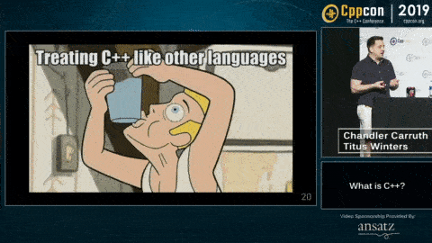

* [WAVES YouTube Channel](https://www.youtube.com/channel/UC285Y5aPovoYtiQbc85SAFQ)

## Learning & Exploring C++

* [HackerRank C++ Practice](https://www.hackerrank.com/domains/cpp)
* Lipman, Lajoie, and Moo's [C++ Primer](http://www.worldcat.org/oclc/1105800812) textbook
* Anthony Calandra's [list of modern C++ features, with examples](https://github.com/AnthonyCalandra/modern-cpp-features)
* the [CppCon youtube channel](https://www.youtube.com/user/CppCon)
* The Cherno's [C++ youtube series](https://www.youtube.com/watch?v=18c3MTX0PK0&list=PLlrATfBNZ98dudnM48yfGUldqGD0S4FFb)
* Jason Turner's [C++ Weekly youtube series](https://www.youtube.com/watch?v=EJtqHLvAIZE&list=PLs3KjaCtOwSZ2tbuV1hx8Xz-rFZTan2J1)
* The [CppCast youtube channel](https://www.youtube.com/channel/UCuCjADS4u3uJDTqUaG0H9dA)

## Evolution, Digital Evolution, & Artificial Life

* [University of California Museum of Paleontology's "Understanding Evolution"](https://evolution.berkeley.edu/evolibrary/article/0_0_0/evo_01)
* [University of California Museum of Paleontology's "Misconceptions about Evolution"](https://evolution.berkeley.edu/evolibrary/misconceptions_faq.php)
* [Christoph Adami - Introduction to the digital evolution platform Avida](https://www.youtube.com/watch?v=ouF8wKxXWFQ)

## C++ Reference Materials

* [cppreference.com](https://cppreference.com/)
* the current [ISOC++ Working Draft](http://www.open-std.org/jtc1/sc22/wg21/docs/papers/2018/n4778.pdf)
* the [C++ Super-FAQ](https://isocpp.org/faq)
* the [C++ Core Guidelines](https://github.com/isocpp/CppCoreGuidelines/blob/master/CppCoreGuidelines.md)

## C++ Tools

* [Quick C++ Benchmark](http://quick-bench.com/)
* [Compiler Explorer](https://godbolt.org/)
* [C++ Insights](https://cppinsights.io/)
* [Wandbox](https://wandbox.org)

## Projects & Repositories

* Empirical
  * [repository](https://github.com/devosoft/Empirical)
  * [documentation](https://empirical.readthedocs.io/)
  * [continuous integration](https://travis-ci.org/github/devosoft/Empirical)
  * [project template](https://github.com/devosoft/cookiecutter-empirical-project)
* MABE
  * [repository](https://github.com/hintzelab/mabe)
  * [wiki](https://github.com/Hintzelab/MABE/wiki/)
  * [gitter](https://gitter.im/hintze-lab/MABE)
* Avida-ED
  * [repository](https://github.com/DBlackwood/AvidaED_user_interface)
  * [web app](https://avida-ed.msu.edu/app/AvidaED.html)
* Avida
  * [repository](https://github.com/devosoft/Avida)
  * [homepage](http://avida.devosoft.org/)
* SignalGP
  * [repository](http://github.com/amlalejini/signalgp)
